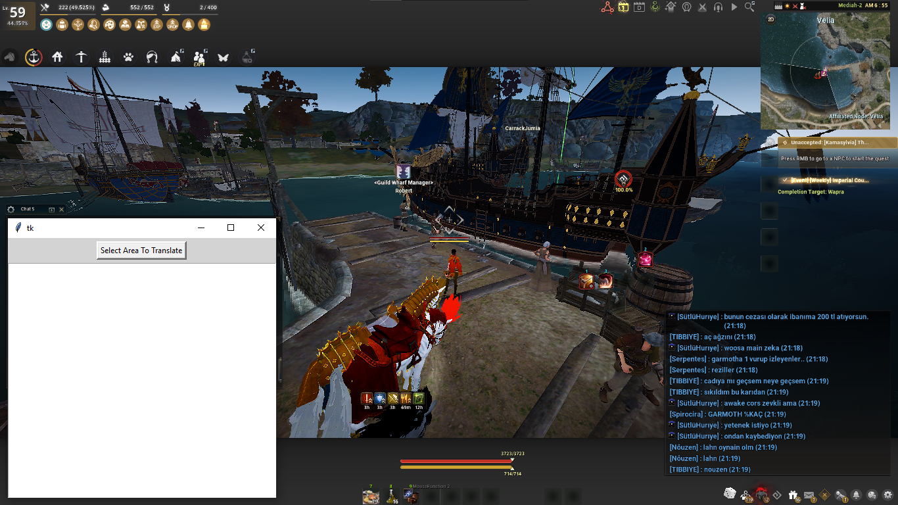
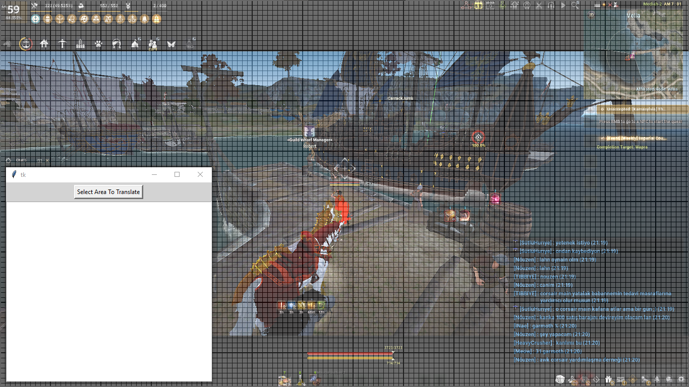
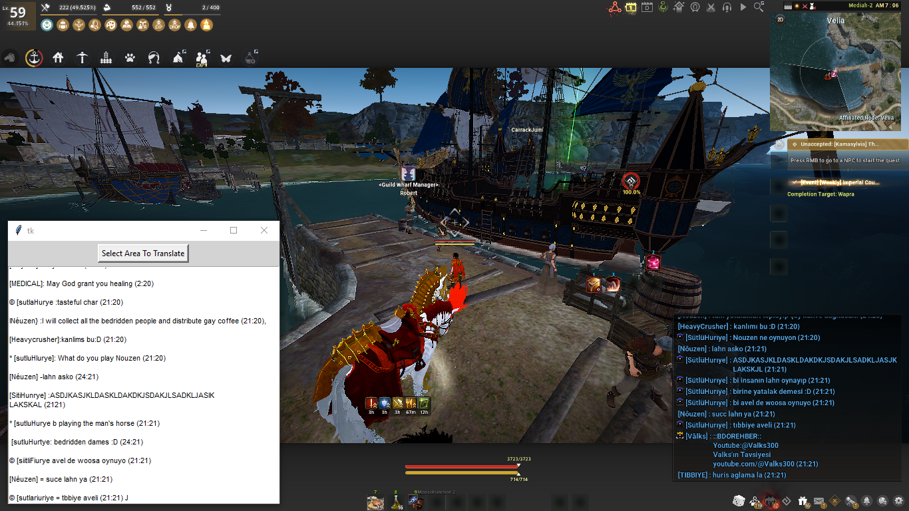

# Game-overlay Translator

A program that uses the tesseract-ocr + googletrans API to translate any image selected by the user.

## requirements 

install google [tesseract-ocr](https://github.com/tesseract-ocr/tesseract)

install googletrans api

```bash
pip install googletrans
```


## How it works?

when the program starts, it asks the user to select the area of the screen that has the text to be translated.

for example, this is black desert online MENA server where everyone talks Turkish

we launch the script:



then we specify the chat area using



then the magic happens, the translation starts immediately and in real-time.




### Notice 

**the idea is still under development and it is worth exploring...** 